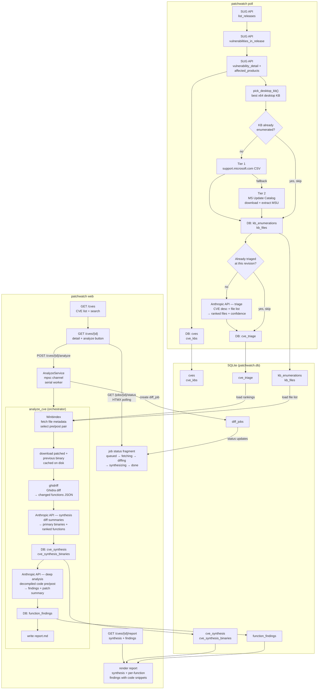

# PatchWatch Data Flow

```mermaid
flowchart TD
    subgraph POLL ["patchwatch poll"]
        direction TB
        SUG1["SUG API<br/>list_releases"] --> SUG2["SUG API<br/>vulnerabilities_in_release"]
        SUG2 --> SUG3["SUG API<br/>vulnerability_detail +<br/>affected_products"]
        SUG3 --> PICK["pick_desktop_kb()<br/>best x64 desktop KB"]
        PICK --> KB_CHECK{KB already<br/>enumerated?}
        KB_CHECK -- no --> T1["Tier 1<br/>support.microsoft.com CSV"]
        T1 -- fallback --> T2["Tier 2<br/>MS Update Catalog<br/>download + extract MSU"]
        T1 --> DB_KB["DB: kb_enumerations<br/>kb_files"]
        T2 --> DB_KB
        KB_CHECK -- yes, skip --> DB_KB
        DB_KB --> TRIAGE_CHECK{Already triaged<br/>at this revision?}
        TRIAGE_CHECK -- no --> LLM1["Anthropic API — triage<br/>CVE desc + file list<br/>→ ranked files + confidence"]
        LLM1 --> DB_TRIAGE["DB: cve_triage"]
        TRIAGE_CHECK -- yes, skip --> DB_TRIAGE
        SUG3 --> DB_CVE["DB: cves<br/>cve_kbs"]
    end

    subgraph WEB ["patchwatch web"]
        direction TB
        UI1["GET /cves<br/>CVE list + search"] --> UI2["GET /cves/{id}<br/>detail + analyze button"]
        UI2 -- "POST /cves/{id}/analyze" --> QUEUE["AnalyzeService<br/>mpsc channel<br/>serial worker"]
        QUEUE --> ORCH
        UI2 -- "GET /jobs/{id}/status<br/>HTMX polling" --> STATUS["job status fragment<br/>queued → fetching → diffing<br/>→ synthesizing → done"]
        UI3["GET /cves/{id}/report<br/>synthesis + findings"] --> REPORT_VIEW
    end

    subgraph ORCH ["analyze_cve (orchestrator)"]
        direction TB
        WB["Winbindex<br/>fetch file metadata<br/>select pre/post pair"] --> DL["download patched +<br/>previous binary<br/>cached on disk"]
        DL --> GHIDRA["ghidriff<br/>Ghidra diff<br/>→ changed functions JSON"]
        GHIDRA --> LLM2["Anthropic API — synthesis<br/>diff summaries<br/>→ primary binaries + ranked functions"]
        LLM2 --> DB_SYN["DB: cve_synthesis<br/>cve_synthesis_binaries"]
        DB_SYN --> LLM3["Anthropic API — deep analysis<br/>decompiled code pre/post<br/>→ findings + patch summary"]
        LLM3 --> DB_FIND["DB: function_findings"]
        DB_FIND --> MD["write report.md"]
    end

    subgraph DB ["SQLite (patchwatch.db)"]
        direction TB
        T_CVES["cves<br/>cve_kbs"]
        T_KB["kb_enumerations<br/>kb_files"]
        T_TRIAGE["cve_triage"]
        T_JOBS["diff_jobs"]
        T_SYN["cve_synthesis<br/>cve_synthesis_binaries"]
        T_FIND["function_findings"]
    end

    DB_CVE --> T_CVES
    DB_KB --> T_KB
    DB_TRIAGE --> T_TRIAGE

    T_TRIAGE -- "load rankings" --> WB
    T_KB -- "load file list" --> WB

    QUEUE -- "create diff_job" --> T_JOBS
    T_JOBS -- "status updates" --> STATUS

    DB_SYN --> T_SYN
    DB_FIND --> T_FIND

    T_SYN --> REPORT_VIEW["render report<br/>synthesis + per-function<br/>findings with code snippets"]
    T_FIND --> REPORT_VIEW
```
